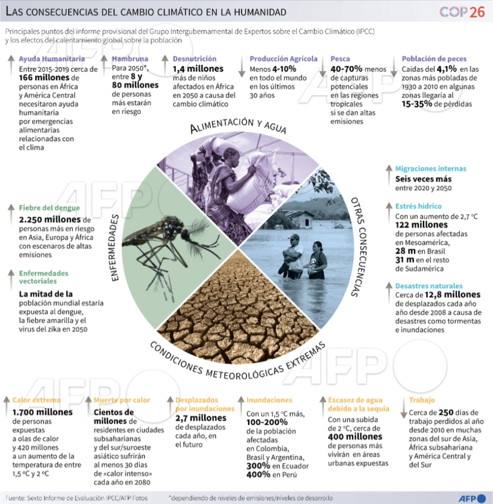

Ambas infografías por analizar pertenecen a la Agencia Internacional de Noticias France Presse, elaboradas en el marco de la convención COP26 y las cuestiones climáticas tratadas durante estas jornadas. 

- Riesgo de Sequía en el mundo:
https://www.france24.com/es/minuto-a-minuto/20211004-cambio-climático-catástrofes-en-serie

En cuanto a la primera infografía, que trata de analizar el riesgo actual de la vulnerabilidad de los territorios a la sequía en el mundo, resulta interesante la forma en la que utiliza los datos para hacer una regresión de colores que marca de forma muy visual la diferencia de riesgos. Al ser unos datos muy concretos que se aplican a nivel mundial, la elección de este formato del mapa es muy interesante y permite entender la dimensión del problema.

Como marca la leyenda, la fuente es el Borrador del Sexto Informe de Evaluación IPCC, que se basa en el indicador de riesgo marcado por los decimales desde el 0 al 1. Si bien es un indicador exhaustivo que toma en cuenta la sensibilidad, la vulnerabilidad y la exposición a la sequía, es cierto que no proporciona información de todos los territorios que muestra el mapa, que aparecen en gris porque no hay datos suficientes.

En general, resulta una infografía muy útil para entender los riesgos mundiales a la sequía, resume de forma muy visual el problema climático en el mundo.

- Las consecuencias del cambio climático en la humanidad:
 https://twitter.com/AFPespanol/status/1457348613185708036
 

La infografía, también de France Presse, presenta de forma genérica las consecuencias del cambio climático en la humanidad, tomando los datos del Sexto Informe de Evaluación IPCC. Se trata de una infografía bastante general, en la que los datos suponen la parte principal de la imagen. En el centro, un eje divide cada uno de los aspectos más relevantes de estos efectos del cambio climático. 

Esta división se realiza por colores, es decir, que el color de la imagen de cada parte del eje coincide con el de los diferentes títulos de cada apartado. Esta distinción permite comprender más fácilmente la infografía, que el lector no se pierda entre tanta cantidad de información. 

El hecho de que segmenten estas consecuencias facilita enormemente la comprensión. Además de esta distinción por colores, los bloques temáticos tienen una separación entre sí. Además, los datos más importantes aparecen resaltados tipográficamente en negrita para destacar la información clave. 

A pesar de que han intentado filtrar esta información y hacerla más accesible, lo cierto es que tiene demasiados datos y apartados. Quizás si la distribución de los elementos hubiera sido realizada con otros formatos, por ejemplo, por bloques visualmente separados, sería más fácil prestar atención. A diferencia del mapa de la primera infografía en la que primaba lo visual y la representación, en esta hay demasiada información numérica. En cualquier caso, resulta de utilidad para comprender cada una de las formas en las que el cambio climático afecta al ser humano. 

